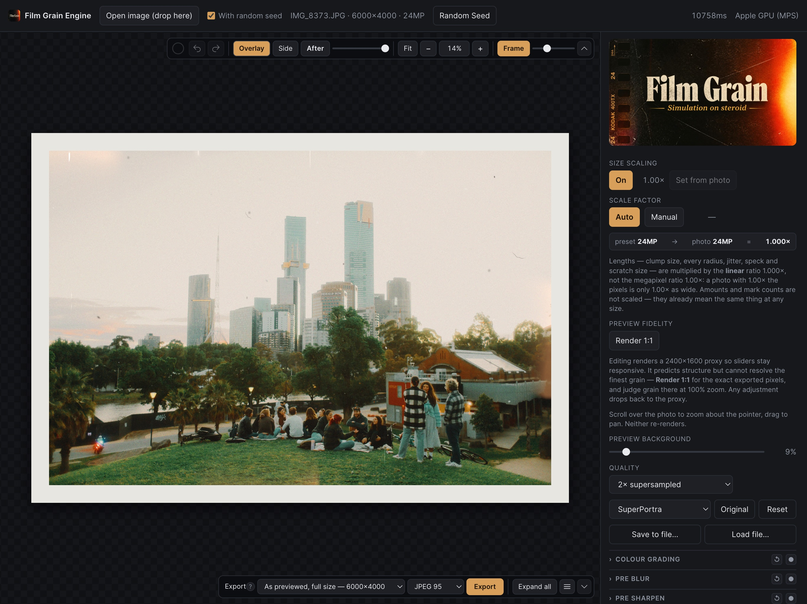

# Film Grain Engine


Organic film grain, edge destruction and halation for still photographs.
Python/PyTorch image service behind a React UI, served as one process.



## Requirements

* Python 3.13 (via `pipenv`) — PyTorch has no 3.14 wheels yet
* Node 24 (via `nvm`, pinned in `.nvmrc`)

## Setup

```bash
export PIPENV_VENV_IN_PROJECT=1
pipenv --python "$(brew --prefix)/bin/python3.13" install

nvm use            # reads .nvmrc
cd web && npm install && npm run build && cd ..
```

> On this machine Homebrew and Laravel Herd sit ahead of nvm in `PATH`, so
> `nvm use` alone may not switch `node`. The scripts below prepend nvm's bin
> explicitly.

## Run

```bash
./run-prod.sh     # http://127.0.0.1:8000  -- build, then run the distribution
./run.sh          # http://127.0.0.1:8000  -- production, from the source tree
./dev.sh          # http://localhost:5173  -- Vite HMR + uvicorn --reload
```

`run.sh` passes extra arguments through to uvicorn (`./run.sh --port 9000`).
All accept `PORT=8001` and refuse to start with a clear message if the port is
already held. `HOST=0.0.0.0 ./run.sh` exposes it on the network — there is no
auth and no rate limiting, so only on a network you trust.

## Build a distribution

```bash
./build.sh                # compile into build/
./build.sh --venv         # ...and install its dependencies (slow -- torch)
./build.sh --clean        # wipe build/ first
./build/run.sh            # run it
```

`build/` is self-contained apart from the Python environment: the compiled
client, the server package, a `requirements.txt` frozen from `Pipfile.lock`, a
`VERSION` stamp, and its own launcher. Copy it anywhere.

The launcher looks for an interpreter in this order: `$FILM_GRAIN_PYTHON`, then
`build/.venv`, then `python3` on `PATH`. To reuse this project's environment
instead of installing a second copy of torch:

```bash
FILM_GRAIN_PYTHON=../.venv/bin/python ./build/run.sh
```

`./run-prod.sh` does that automatically.

## Environment

| variable | default | what it does |
|---|---|---|
| `APP_ENV` | `production` | `development` enables CORS for Vite's origin and `/docs` |
| `PORT` / `HOST` | `8000` / `127.0.0.1` | where to listen |
| `FILM_GRAIN_DEFAULT_PRESET` | `Stock` | preset the client opens on, and what Reset returns to |
| `FILM_GRAIN_PRESETS` | `presets/` | read the preset library from elsewhere |
| `FILM_GRAIN_DEFAULT_REFERENCE_MP` | unset | treat unstamped presets as authored at this size |
| `FILM_GRAIN_TILE_BUDGET_GB` | half the device's recommended max | render memory pool; lower it to reproduce a smaller machine |
| `FILM_GRAIN_GRAIN_CACHE_GB` | 25% of the pool | Global Grain texture cache cap |
| `FILM_GRAIN_CHECKPOINT_GB` | 15% of the pool | pipeline checkpoint cache; 0 disables it |
| `FILM_GRAIN_PYTHON` | unset | interpreter for `build/run.sh` |

**Production is the default**, because dev is the mode that needs holes in it:

| | development | production |
|---|---|---|
| CORS for `localhost:5173` | on | off (same-origin) |
| `/docs`, `/openapi.json` | served | 404 |
| missing client build | 503 with a hint | refuses to start |

## Using it

* **Open image** or drop a file on the canvas. JPEG or PNG, up to 30MB.
  Multi-frame camera JPEGs (MPO) are read as their primary frame.
* **Scroll over the photo to zoom**, drag to pan; or use the `Fit / − / % / +`
  bar. None of it re-renders, so navigating is instant.
* **Editing renders a 2400px proxy** so sliders stay responsive. **Render 1:1**
  re-renders the whole frame at full resolution, at which point the preview *is*
  the export. Any adjustment drops back to the proxy — judge grain at 100% zoom
  only after Render 1:1, since the proxy carries a `proxy` badge for a reason.
* **Compare** sits on the preview bar: *Overlay* wipes between the two (hold
  **B** to peek at the original), *Side* zooms and pans both panes together.
* **Quality** selects supersampling — 0.5× / 1× / 1.5× / **2× (default)** / 3×.
  Cost is roughly the square of the factor. 2× is what every preset was dialled
  in against; 1× renders at the output grid and gives grain a hard, aliased pixel
  footprint; 0.5× renders *below* the output and scales up, which is genuinely
  lossy and is there for machines that cannot afford anything else.
* **The bar warns when a render is over budget** — 5s on a GPU, 10s on CPU — and
  offers the next factor down. It is the safety net for settings that are
  expensive rather than wrong.
* **Export always writes full size**, and the menu picks the supersample —
  `Full size W×H / SS 0.5× … 3×`, default 2×. It is a quality choice, not a size
  one: below 1 the frame renders smaller than its output and is scaled up, above
  it renders finer and is integrated down. Cost is roughly the square of the
  factor. Files carry the factor in the name unless it is the default.
* **JPEG 95 is the default format** — 100.2% of the grain sigma at 0.43MB
  against 9.82MB for 16-bit PNG, encoded 4:4:4 so chroma grain survives. Choose
  **PNG 16-bit** when the file is going on for further grading.
* **Presets are the `presets/` folder**, one `.json` each, read fresh on every
  page load — drop a file in and it appears. Each lists all 112 parameters in
  panel order, though a hand-written `{"intensity": 40}` loads just as well:
  unknown keys are dropped, values clamped, anything absent filled from its
  default. **LUTs are the `luts/` folder**, same idea, plus **Load .cube…** for
  a one-session upload.

Control-by-control guidance is in
[docs/using-the-controls.md](docs/using-the-controls.md).

## Verify

```bash
pipenv run python tests/verify.py                 # everything, in parallel (~36s)
pipenv run python tests/verify.py edges scatter   # only those modules
pipenv run python tests/verify.py -l              # list the modules
```

362 checks across 17 modules — tile independence, crop fidelity, colour
pass-through, luminance response, edge bias, scatter, the colour-grading section
and its `.cube` parsing, 16-bit PNG validity. Run it after touching anything
under `server/engine/`; it exits non-zero on failure. See
[docs/testing.md](docs/testing.md).

**Two invariants carry the whole design.** *Tile independence*: no stage may
depend on a statistic of the region being rendered, or exports grow seams that
previews never show. *Scale invariance*: spatial quantities are in
full-resolution pixels multiplied by the working scale, or the preview stops
predicting the export.

## Layout

```
server/
  params/        parameter schema -- single source of truth for engine and UI
  engine/        the grain pipeline (constants/, stages/, noise/, tiling.py)
  models/        Upload and export jobs
  services/      the one render path both preview tiers take
  controllers/   FastAPI routers, one per area
  runtime.py     device, engine and the render lock
  imageio.py     decode/encode, including a 16-bit RGB PNG writer
  lut.py         .cube 3D LUT loading
web/src/         models/ services/ controllers/ views/
presets/         preset library -- files, not code
luts/            3D LUTs -- drop a .cube in and it is in the menu
```

## Documentation

[CLAUDE.md](CLAUDE.md) is the working context — state, constraints and the
reasoning behind decisions that are not obvious from the code. It indexes
`docs/`, which covers the pipeline order, each stage's design, the tuning
constants and their measurements, testing, and performance.

Start with [docs/architecture.md](docs/architecture.md) for the layout,
[docs/lessons.md](docs/lessons.md) before changing the engine, and
[docs/performance.md](docs/performance.md) before optimising it.

## Not implemented

* RAW input (needs `rawpy`/LibRaw)
* The neural pipeline — needs a paired film-scan dataset that does not exist yet
